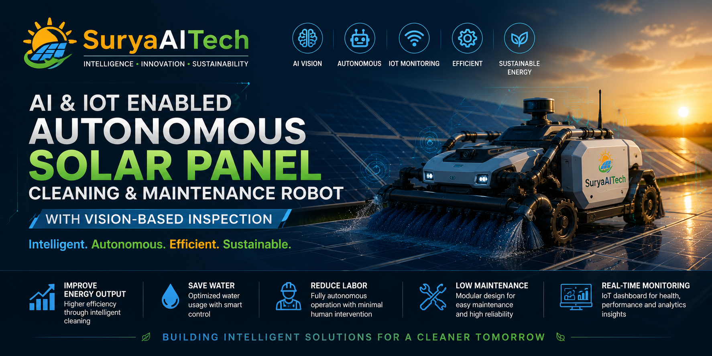

  

# 🤖 AI & IoT Enabled Autonomous Solar Panel Cleaning and Intelligent Maintenance Robot

### 🚀 Developed by SuryaAITech

An AI-powered autonomous robotic system designed for utility-scale solar power plants that performs vision-based inspection, intelligent decision-making, need-based cleaning, and real-time IoT monitoring.

---

# 📌 Project Overview

This project aims to automate solar panel cleaning using Artificial Intelligence, Computer Vision, Robotics, and IoT technologies.

The robot inspects solar panels, decides whether cleaning is required, performs autonomous cleaning, and uploads operational data to a cloud dashboard.

---

# ❗ Problem Statement

Solar power plants suffer significant efficiency losses due to dust accumulation, bird droppings, and environmental pollutants. Traditional cleaning methods are labor-intensive, water-intensive, costly, and inefficient for large-scale solar farms.

Existing robotic solutions are often expensive, require frequent manual supervision, and lack intelligent decision-making capabilities.

There is a growing need for an autonomous, AI-driven robotic solution capable of inspecting, analyzing, and cleaning solar panels efficiently while providing real-time monitoring and predictive maintenance support.

# 🎯 Objectives

- Develop a fully autonomous solar panel cleaning robot.
- Perform AI-based visual inspection of solar panels.
- Detect dust accumulation and cleaning requirements.
- Improve overall energy generation efficiency.
- Reduce manual labor and operational costs.
- Enable real-time monitoring through IoT.
- Support predictive maintenance for large solar farms.
- Build a scalable and intelligent robotic maintenance solution.
